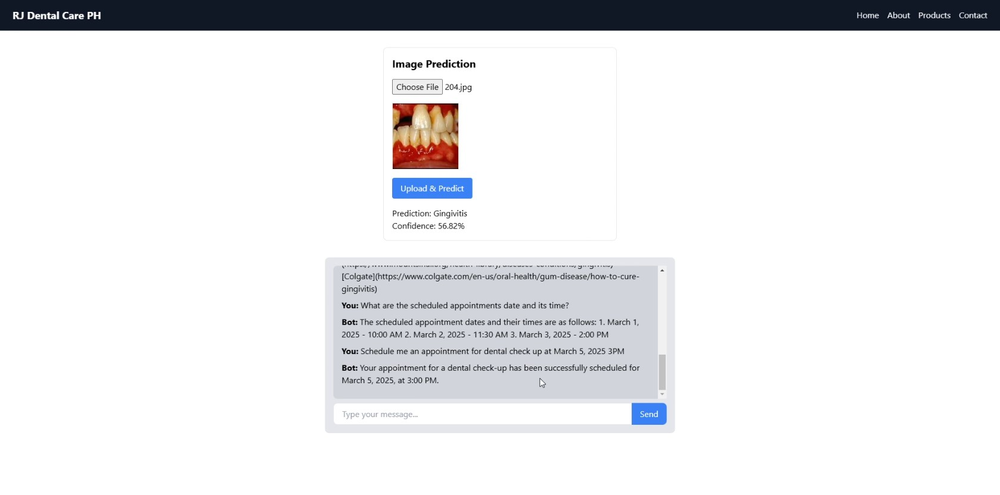

# RJ Dental Care PH

An AI-powered dental care application by **RJ Dental Care PH**, a dental service provider offering both **onsite dental clinic** appointments and an **online AI assistant**. This system combines **FastAPI** (backend), **React** (frontend), and **LangChain** and **LangGraph** for an intelligent ReAct agent that can execute SQL queries on a PostgreSQL database or handle general dental inquiries. It also provides ephemeral memory for multi-turn dialogue and a computer vision agent for oral disease classification.

## Table of Contents
- [Overview](#overview)
- [Demo](#demo)
- [Features](#features)
- [Project Structure](#project-structure)
- [Setup & Installation via Docker Compose](#setup--installation-via-docker-compose)
- [Usage](#usage)

## Overview
**RJ Dental Care PH** is both a **dental clinic** offering onsite appointments and an **online AI assistant** that can:
1. **Execute SQL queries** on a PostgreSQL database (tables `patients` and `appointments`).
2. **Answer general dental questions** (via a search tool).
3. **Maintain ephemeral conversation** context through an in-memory store.
4. **Perform image-based oral disease classification** using a computer vision model.

## Demo
Watch a short demo of RJ Dental Care PH in action:

[](docs/demo.mp4)

*If the video does not play, [click here](docs/demo.mp4) to view the demo directly.*

## Features
- **Onsite Dental Clinic + AI Assistant**  
  Manage and schedule clinic appointments onsite while leveraging the AI’s capabilities online.
- **LangChain ReAct Agent**  
  Employs a ReAct agent to interpret user queries—either calling the **PostgreSQL** tool for database actions or the **Search** tool for dental health info.
- **Ephemeral Memory**  
  Implements a `WindowMemoryManager` to store conversation context in memory for each user session.
- **Computer Vision for Disease Prediction**  
  A dedicated `cv_agent.py` that identifies oral diseases from images, returning predictions and confidence scores.
- **Dockerized Deployment**  
  Frontend (React), backend (FastAPI), and database all run via Docker Compose for a seamless setup.

## Project Structure
```bash
RJ-Dental-Care-PH/
├── frontend/                           # React Frontend
│   └── src/
│   │   └── components/
│   │   │   ├── ChatBox.js             # Chat UI, connects to /chat endpoint
│   │   │   ├── ImageUpload.js         # For uploading images (e.g. oral disease prediction)
│   │   │   ├── Navbar.js              # Navigation bar
│   │   └── pages/
│   │   │   ├── About.js
│   │   │   ├── Contact.js
│   │   │   ├── Home.js
│   │   │   ├── Product.js
│   │   ├── App.css                    # CSS for App.js
│   │   ├── App.js                     # Main React component
│   │   ├── App.test.js
│   │   ├── index.css                  # Global styles
│   │   ├── index.js                   # Renders <App /> to DOM
│   │   ├── reportWebVitals.js
│   │   ├── setupTests.js
│   ├── Dockerfile                     # Docker config for React
│   ├── package-lock.json
│   ├── package.json
│   ├── postcss.config.js
│   ├── tailwind.config.js
├── backend/                           # FastAPI Backend
│   ├── app/
│   │   ├── main.py                    # FastAPI entry point
│   │   ├── api/
│   │   │   └── routes.py             # Defines /chat, /predict endpoints
│   │   ├── core/
│   │   │   ├── agent.py              # Single ReAct agent w/ ephemeral memory
│   │   │   ├── tool.py               # QueryPostgreSQLTool + optional SearchTool
│   │   │   ├── memory.py             # WindowMemoryManager (in-memory conversation)
│   │   │   └── cv_agent.py           # CV agent for oral disease classification
│   │   └── models/
│   │       └── oral_disease_model.h5 # Trained model for disease prediction
│   ├── Dockerfile                     # Docker config for FastAPI
│   ├── requirements.txt              # Python dependencies
├── database/
│   ├── init.sql                       # Initialization SQL (tables, data)
│   ├── Dockerfile                     # Docker config for PostgreSQL container
├── docker-compose.yml                 # Multi-container setup (frontend, backend, DB)
└── README.md                          # Project documentation
```

## Setup & Installation via Docker Compose
1. **Clone the Repository**  
   ```bash
   git clone https://github.com/yourusername/RJ-Dental-Care-PH.git
   cd RJ-Dental-Care-PH
2. Configure Environment Variables
Create a .env file (or set system environment variables) with the following content, replacing the placeholders as needed:
    ```bash
    # .env
    # FastAPI settings
    DEBUG=True

    # Database settings
    POSTGRES_USER=your_username
    POSTGRES_PASSWORD=your_password
    POSTGRES_DB=rj_dental_db

    # OpenAI API Key
    OPENAI_API_KEY=sk-YourOpenAIKeyHere

    # LangChain
    LANGCHAIN_TRACING_V2=true
    LANGCHAIN_API_KEY=lsv2_pt_YourLangChainKey
    LANGSMITH_PROJECT="rj-dental-care-backend"

    # Tavily
    TAVILY_API_KEY=tvly-YourTavilyKeyHere
    ```
    Note:
    - Never commit real API keys to version control.
    - In production or CI/CD, store these in a secrets manager or environment variable store.
3. Run Docker Compose
    ```bash
    docker compose up --build
    ```
    This starts containers for the backend, frontend, and database. The React UI is served at http://localhost:3000, and the FastAPI API is available at http://localhost:8000.

## Usage
RJ Dental Care PH provides an intelligent chat interface for managing dental queries and appointments, as well as a tool for oral disease classification. Below are instructions on how to interact with the API:
- Chat Endpoint (`POST /api/chat`)
  - Send JSON:
  ```json
  {
    "session_id": "some-session-id",
    "message": "Please execute: SELECT * FROM appointments;"
  }
  ```
  - Response:
  ```json
  {
    "final_response": "Query Results: [...]"
  }
  ```
- Predict Endpoint (POST /api/predict)
  - Upload an image to get a classification:
  ```json
  {
    "prediction": "Caries or Gingivitis",
    "confidence": 92.45
  }
  ```
- Ephemeral Memory
  - The frontend uses a session_id (e.g. localStorage) to maintain multi-turn dialogues in memory.

## Model Training & Experimentation
For details on how the oral disease classification model was developed, evaluated, and refined, please refer to the [training](training/) folder.

With the onsite clinic and online AI assistant, RJ Dental Care PH provides comprehensive oral healthcare both in person and via an intelligent chat interface.
