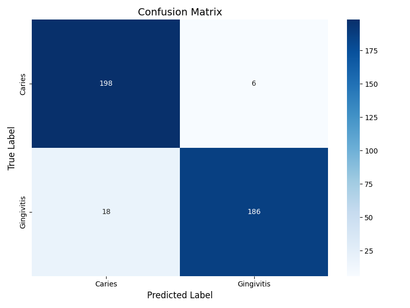

# Oral Disease Classification - Model Training & Experimentation

This folder contains all resources for training, experimenting, and evaluating the oral disease classification model used in the RJ Dental Care PH project. The model leverages transfer learning (e.g., with MobileNetV2) to classify dental images into categories such as **Caries** and **Gingivitis**. These materials form the foundation for the AI-powered dental services, which complement the onsite dental clinic operations.

## Table of Contents
- [Project Overview](#project-overview)
- [Features](#features)
- [Technologies Used](#technologies-used)
- [How to Run the Training Process](#how-to-run-the-training-process)
- [Folder Structure](#folder-structure)
- [Model Performance](#model-performance)
- [Insights](#insights)
- [Future Work](#future-work)
- [Conclusion](#conclusion)

## Project Overview
This project focuses on using deep learning to classify oral diseases. It was developed using transfer learning techniques with MobileNetV2, achieving high accuracy on both validation and test datasets. These materials support the RJ Dental Care PH service, which integrates an AI assistant with an onsite dental clinic to offer comprehensive oral healthcare.

## Features
- **Data Preprocessing & Augmentation**: Scripts for cleaning and augmenting dental image data.
- **Model Training**: A training pipeline using transfer learning to build a robust oral disease classification model.
- **Evaluation & Testing**: Tools and scripts to assess model performance, including visualizations.
- **Documentation & Results**: Detailed logs, images, CSVs, and other artifacts documenting the training process.

## Technologies Used
- **Python** for model training and scripting.
- **TensorFlow/Keras** for deep learning.
- **MobileNetV2** for transfer learning.
- **Jupyter Notebooks** for interactive exploration and visualization.
- **Pandas, NumPy, Matplotlib**, and other libraries for data processing and analysis.

## How to Run the Training Process
1. **Set Up a Virtual Environment**
    - Ensure you have **Python 3.10** installed.
   ```bash
   python3.10 -m venv venv
   source venv/bin/activate  # On Windows: venv\Scripts\activate
2. **Install Training Dependencies**
    ```bash
    pip install -r requirements_training.txt
    ```
3. **Run the Training Pipeline**
- Interactive Training:
    Open `notebooks/oral_disease_classification.ipynb` in Jupyter Notebook or Jupyter Lab to explore and run the training process interactively.
- Command Line Execution:
    You can either run each script separately (allows you to re-run or modify individual steps):
    ```bash
    python src/preprocess.py
    python src/train.py
    python src/test.py
    ```
    or run the entire pipeline in one go:
    ```bash
    python run_pipeline.py
    ```
    The `run_pipeline.py` script consolidates the preprocessing, training, and testing steps, running them in sequence.
- Saved Models:
    After training, the model will be saved in the `models/` directory.

## Folder Structure
```bash
training/
├── notebooks/
│   └── oral_disease_classification.ipynb   # Interactive notebook for model training and experimentation
├── models/                                 # Contains the trained model files
├── src/
│   ├── results/                            # Outputs (logs, images, CSVs, etc.) from training and evaluation
│   ├── preprocess.py                       # Data preprocessing and augmentation scripts
│   ├── train.py                            # Main script for training the model
│   └── test.py                             # Script for model evaluation and testing
└── requirements_training.txt               # Python dependencies for training and experimentation
```

## Model Performance

| Metric                  | Value       |
|-------------------------|-------------|
| **Validation Accuracy** | 96.6%       |
| **Test Accuracy**       | 95.1%       |

#### **Confusion Matrix**

The confusion matrix on the test data demonstrates the classification performance:



- **Caries**:
  - True Positives: 198
  - False Negatives: 6
- **Gingivitis**:
  - True Positives: 186
  - False Negatives: 18

## **Insights**
- The model achieved high classification accuracy with minimal false negatives and false positives.
- It performs well on test data, supporting reliable predictions for early diagnosis.
- The experimentation provided valuable insights into optimal hyperparameters and training strategies.

## **Future Work**
1. Dataset Expansion:
- Add a "Healthy" class to detect images with no disease.
- Increase dataset size by including more diverse data covering different lighting, orientations, and demographics to improve generalization.
2. Advanced Augmentation Techniques: Explore further data augmentation techniques such as brightness adjustments, rotations, and noise injection to better prepare the model for real-world variability.
3. Alternative Architectures: Experiment with other lightweight models (e.g., EfficientNet, DenseNet) for potential performance improvements while maintaining efficiency.
4. Integration: Streamline the pipeline for seamless integration with the production system.

## Conclusion
This training and experimentation pipeline forms the backbone of the AI-powered oral disease classification system. By leveraging deep learning and transfer learning techniques, the model achieves high accuracy, providing reliable support for RJ Dental Care PH’s comprehensive dental service. The materials here enable continued research and development, ensuring the system can evolve with new data and techniques.
